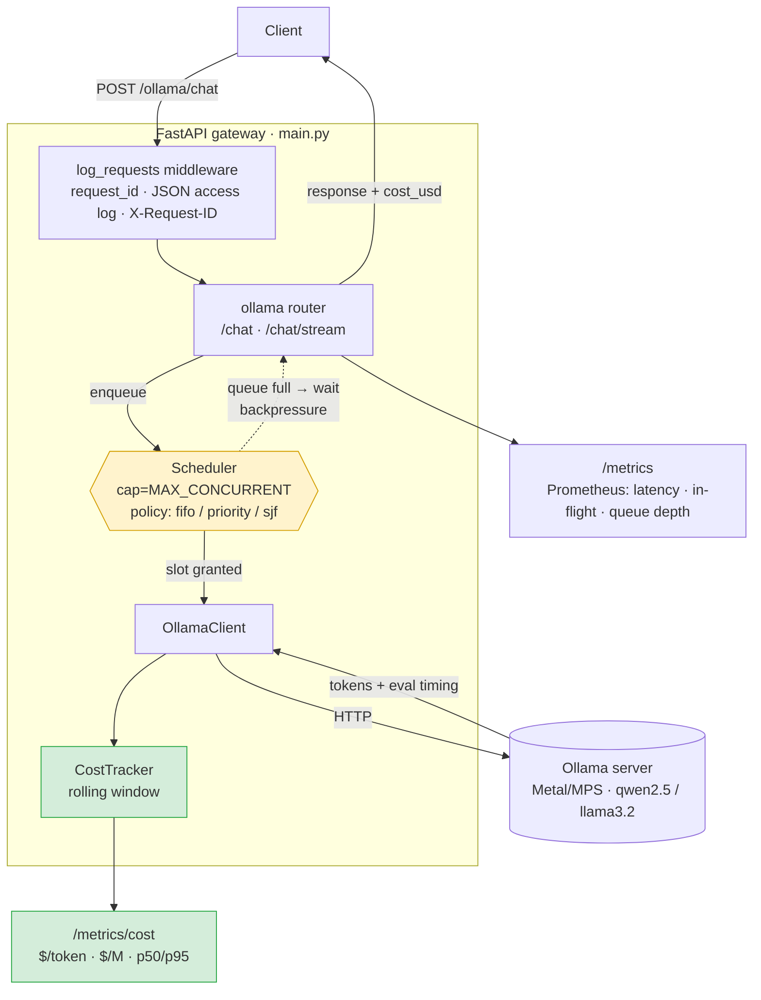

# mini-llm-gateway

A minimal FastAPI inference gateway that sits in front of a local model server
(Ollama on Apple M1, Metal/MPS) and exposes a clean HTTP API for inference —
while treating cost as a first-class, measured quantity.

Most gateways report latency and request counts. This one also reports **what
inference actually costs in dollars**, live, per request and in aggregate.

## Architecture

One request's path through the gateway. The middleware tags and logs every
request; the **scheduler** admits a bounded number concurrently and decides the
order of the rest; the **cost tracker** turns each completion into a dollar
figure that both the response and `/metrics/cost` expose.



The two instrumented edges — the **scheduler** (yellow) and the **cost layer**
(green) — are what distinguish this from a pass-through proxy: one governs
*which request runs when*, the other reports *what each one cost*.

## Running

```bash
pip install -r requirements.txt
GPU_HOURLY_RATE=0.80 uvicorn main:app --reload
```

`BACKEND` selects the backend (`ollama`, default). `GPU_HOURLY_RATE` sets the
economic input (USD/hour) used for all cost math; default `0.80`. `SCHED_POLICY`
selects the request-scheduling policy (below; default `fifo`).

## Request scheduling

Concurrency to the model is capped (`MAX_CONCURRENT`, the backpressure knob);
when more requests arrive than there are slots, the rest queue. **Which queued
request runs next is a policy decision**, set by `SCHED_POLICY`:

| Policy | Order | Use it for |
|---|---|---|
| `fifo` | arrival order (default) | fairness; matches a plain semaphore |
| `priority` | higher request `priority` first, ties by arrival | putting interactive traffic ahead of batch jobs |
| `sjf` | shortest job first by `max_tokens` | minimizing mean wait; attacks head-of-line blocking (can starve large jobs) |

`priority` reads a `priority` field on the request (default `0`):

```bash
SCHED_POLICY=priority uvicorn main:app
curl -s localhost:8000/ollama/chat \
  -d '{"prompt":"urgent","max_tokens":50,"priority":10}'
```

Why it matters: under load, a 30-token request stuck behind a 4k-token
generation waits for the whole thing under FIFO. `sjf`/`priority` let the gateway
reorder the queue so short or important work isn't blocked. The scheduler lives
in [`app/scheduler.py`](app/scheduler.py); ordering and the concurrency cap are
covered by [`test/test_scheduler.py`](test/test_scheduler.py).

## Inference

```bash
curl -s localhost:8000/ollama/chat \
  -d '{"model":"qwen2.5:7b","prompt":"count to 5","max_tokens":50}'
```

Every inference response carries cost metadata alongside the output:

```json
{
  "response": "...",
  "input_tokens": 45,
  "output_tokens": 128,
  "tokens_per_sec": 73.2,
  "cost_usd": 0.0000019
}
```

## `GET /metrics/cost`

Returns live, session-wide cost aggregates:

```json
{
  "cost_per_token": 0.0000000030,
  "cost_per_million_tokens": 3.04,
  "cost_per_request_p50": 0.0000012,
  "cost_per_request_p95": 0.0000041,
  "total_cost_session": 0.0009123,
  "gpu_hourly_rate": 0.80,
  "requests_observed": 412
}
```

`cost_per_*` figures are derived from observed throughput at the configured
`GPU_HOURLY_RATE`; percentiles come from a rolling in-memory window of recent
requests; `total_cost_session` accumulates from process start.

**Why `$/M tokens` is a first-class metric.** Throughput (tokens/sec) and
latency tell you how *fast* a server is, but not whether it's *economical* — a
fast GPU that costs 10× as much can be the worse choice. Cost per million tokens
collapses hardware price and real throughput into the single unit the industry
quotes prices in, making serving options directly comparable. Exposing it live
turns the gateway from a proxy into an observability instrument: you can see the
dollar impact of a model swap, a batch-size change, or idle GPU time the moment
it happens.

> Prometheus operational metrics (request counts, latency, queue depth) remain
> available at `/metrics`.
