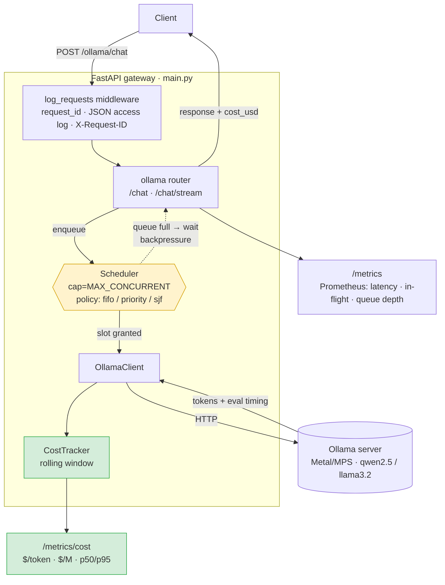

# mini-llm-gateway

A minimal FastAPI inference gateway that sits in front of a local model server
(Ollama on Apple M1, Metal/MPS) and exposes a clean HTTP API for inference —
while treating cost as a first-class, measured quantity.

Most gateways report latency and request counts. This one also reports **what
inference actually costs in dollars**, live, per request and in aggregate.

## Architecture

One request's path through the gateway. The middleware tags and logs every
request; the **scheduler** admits a bounded number concurrently and decides the
order of the rest; the **cost tracker** turns each completion into a dollar
figure that both the response and `/metrics/cost` expose.



The two instrumented edges — the **scheduler** (yellow) and the **cost layer**
(green) — are what distinguish this from a pass-through proxy: one governs
*which request runs when*, the other reports *what each one cost*.

## Running

```bash
pip install -r requirements.txt
GPU_HOURLY_RATE=0.80 uvicorn main:app --reload
```

`BACKEND` selects the backend (`ollama`, default). `GPU_HOURLY_RATE` sets the
economic input (USD/hour) used for all cost math; default `0.80`. `SCHED_POLICY`
selects the request-scheduling policy (below; default `fifo`).

## Request scheduling

Concurrency to the model is capped (`MAX_CONCURRENT`, the backpressure knob);
when more requests arrive than there are slots, the rest queue. **Which queued
request runs next is a policy decision**, set by `SCHED_POLICY`:

| Policy | Order | Use it for |
|---|---|---|
| `fifo` | arrival order (default) | fairness; matches a plain semaphore |
| `priority` | higher request `priority` first, ties by arrival | putting interactive traffic ahead of batch jobs |
| `sjf` | shortest job first by `max_tokens` | minimizing mean wait; attacks head-of-line blocking (can starve large jobs) |

`priority` reads a `priority` field on the request (default `0`):

```bash
SCHED_POLICY=priority uvicorn main:app
curl -s localhost:8000/ollama/chat \
  -d '{"prompt":"urgent","max_tokens":50,"priority":10}'
```

Why it matters: under load, a 30-token request stuck behind a 4k-token
generation waits for the whole thing under FIFO. `sjf`/`priority` let the gateway
reorder the queue so short or important work isn't blocked. The scheduler lives
in [`app/scheduler.py`](app/scheduler.py); ordering and the concurrency cap are
covered by [`test/test_scheduler.py`](test/test_scheduler.py).

## Inference

```bash
curl -s localhost:8000/ollama/chat \
  -d '{"model":"qwen2.5:7b","prompt":"count to 5","max_tokens":50}'
```

Every inference response carries cost metadata alongside the output:

```json
{
  "response": "...",
  "input_tokens": 45,
  "output_tokens": 128,
  "tokens_per_sec": 73.2,
  "cost_usd": 0.0000019
}
```

### Reasoning models — `POST /ollama/think`

For thinking models, `/ollama/think` proxies Ollama's `/api/chat` with `think=true`
and **separates the hidden reasoning from the answer**, billing both and recording
the split — so reasoning traffic flows through the gateway's cost + Prometheus
instrumentation instead of bypassing it.

```bash
curl -s localhost:8000/ollama/think \
  -d '{"model":"deepseek-r1:7b","prompt":"A store had 120 apples. Sold 1/3, then 1/4 of the rest. How many left?"}'
```

```json
{
  "response": "60",
  "thinking": "First, one third of 120 is 40 ...",
  "thinking_tokens": 145,
  "answer_tokens": 262,
  "tokens_per_sec": 41.8,
  "cost_usd": 0.0023611
}
```

It shares the scheduler, cost tracker, and metrics with `/chat`, and adds
`thinking_tokens_total` / `answer_tokens_total` (see below) — the data behind the
dashboard's thinking-share panels. This is the live counterpart to the
[reasoning-tax benchmark](https://github.com/JasperNLiberty/llm-serving-benchmarks/blob/main/REASONING.md).

**Token-split accuracy.** `/think` is non-streaming, so Ollama returns only a
combined `eval_count`; the thinking/answer split is **estimated by character
proportion**. **`POST /ollama/think/stream`** streams `/api/chat` and tags each
delta as thinking or answer, so the split is an **exact** per-token tally (NDJSON:
one line per delta with its `phase`, then a final `done` line with usage + cost).
Use `/think/stream` when the count must be exact; `/think` when a one-shot JSON
response is more convenient.

## `GET /metrics/cost`

Returns live, session-wide cost aggregates:

```json
{
  "cost_per_token": 0.0000000030,
  "cost_per_million_tokens": 3.04,
  "cost_per_request_p50": 0.0000012,
  "cost_per_request_p95": 0.0000041,
  "total_cost_session": 0.0009123,
  "gpu_hourly_rate": 0.80,
  "requests_observed": 412
}
```

`cost_per_*` figures are derived from observed throughput at the configured
`GPU_HOURLY_RATE`; percentiles come from a rolling in-memory window of recent
requests; `total_cost_session` accumulates from process start.

**Why `$/M tokens` is a first-class metric.** Throughput (tokens/sec) and
latency tell you how *fast* a server is, but not whether it's *economical* — a
fast GPU that costs 10× as much can be the worse choice. Cost per million tokens
collapses hardware price and real throughput into the single unit the industry
quotes prices in, making serving options directly comparable. Exposing it live
turns the gateway from a proxy into an observability instrument: you can see the
dollar impact of a model swap, a batch-size change, or idle GPU time the moment
it happens.

> Prometheus operational metrics (request counts, latency, queue depth) remain
> available at `/metrics`.

## Prometheus metrics

`GET /metrics` exposes the Prometheus scrape. Beyond the usual operational
series, **cost is a first-class Prometheus metric** here — most gateways leave
dollars out of the scrape entirely:

| Metric | Type | Meaning |
|---|---|---|
| `chat_requests_total{model,status}` | counter | requests by outcome |
| `chat_latency_seconds` | histogram | end-to-end latency (p50/p95/p99 via `histogram_quantile`) |
| `tokens_generated_total{model}` | counter | output tokens |
| `chat_in_flight` | gauge | requests currently processing |
| `chat_queue_depth` | gauge | requests waiting for a slot |
| `cost_per_million_tokens` | gauge | rolling **$/M tokens** |
| `cost_per_request_p50_usd` / `_p95_usd` | gauge | rolling per-request cost percentiles |
| `cost_session_total_usd` | gauge | cumulative session spend |
| `gpu_hourly_rate_usd` | gauge | the configured economic input |
| `gpu_slots_utilization` | gauge | busy slots / capacity, sampled at scrape |
| `thinking_tokens_total{model}` | counter | hidden reasoning tokens (`/think` requests) |
| `answer_tokens_total{model}` | counter | visible answer tokens (`/think` requests) |

## Observability stack (Prometheus + Grafana)

The stack under [`observability/`](observability/) wires the gateway, Prometheus,
and a **provisioned** Grafana dashboard together — turning the metrics above into
a live **performance-and-cost** board. Two ways to run it; both use the same
dashboard JSON.

### Option A — on the host, no Docker (recommended locally)

Everything is on `localhost`, so there's no container networking to deal with.

```bash
brew install prometheus grafana
ollama serve                                  # Ollama on the host (Metal/MPS)
make serve                                    # the gateway, in one shell
make observe                                  # Prometheus + Grafana, in another
# Grafana :3000 (anon admin) · Prometheus :9090 · Gateway :8000 · Ctrl-C stops both
```

`make observe` runs [`observability/run-local.sh`](observability/run-local.sh),
which generates host-local provisioning (datasource → `localhost:9090`, scrape →
`localhost:8000`) and keeps all runtime data under `observability/.local/`
(git-ignored). Nothing is installed globally beyond the two brew packages.

### Option B — Docker compose

Conventional, runs anywhere with Docker. Ollama still runs on the host (Metal/MPS
isn't available inside Docker on macOS), reached via `host.docker.internal`.

```bash
ollama serve
make observe-docker        # = cd observability && docker compose up --build
```

### What you get

Then drive some load to populate it — `python observability/loadgen.py`, the
traffic generator in
[`llm-serving-benchmarks`](https://github.com/JasperNLiberty/llm-serving-benchmarks)
(`bench/traffic_sim.py`), or a quick loop of `curl`. For the **reasoning panels**,
drive `/ollama/think` traffic:

```bash
python observability/loadgen.py --reasoning   # deepseek-r1:7b -> /ollama/think
```

The dashboard ([`observability/grafana/dashboards/llm-gateway.json`](observability/grafana/dashboards/llm-gateway.json))
leads with **cost** — live $/M tokens, per-request p95, session total — then
performance (latency percentiles, throughput, request rate, in-flight/queue), and
finally **reasoning** (thinking vs answer tokens/sec, and the thinking-token share
— the live overthinking signal).

The standout panel is **effective $/M (utilization-adjusted)**: nominal $/M
assumes a busy GPU, while effective = nominal ÷ utilization shows the *idle-GPU
tax* you actually pay — the live version of "your $/token is higher than the
spec sheet."

> **Dashboards in context:** worked examples that drive this board under real
> load and read the curves live — reasoning, traffic/capacity, model size, and
> more — live in the benchmark repo's case studies:
> [`llm-serving-benchmarks/examples`](https://github.com/JasperNLiberty/llm-serving-benchmarks/tree/main/examples).

### Capture screenshots

With the stack up, one command drives load and saves every panel + the full
board as PNGs — via a headless browser (Playwright), so it needs no Grafana
plugin and works on Apple Silicon.

```bash
pip install playwright && playwright install chromium   # one time
make capture                                            # 60s load -> screenshots/*.png
DURATION=120 MODEL=llama3.2:1b make capture
python observability/capture.py --no-load --theme dark  # capture current state, dark
```

`make capture` runs [`observability/capture.py`](observability/capture.py): it
waits for the stack, fires the stdlib load generator
([`loadgen.py`](observability/loadgen.py)) with mixed prompt sizes, then loads
the provisioned dashboard in headless Chromium and screenshots the full board
and each `d-solo` panel at 2× scale.

> **Alternative (x86_64 / Linux): `make capture-render`** uses Grafana's render
> API instead ([`capture.sh`](observability/capture.sh)). Note the
> `grafana-image-renderer` plugin has **no darwin-arm64 build**, so on Apple
> Silicon use the Playwright path above (or screenshot the live board at
> `localhost:3000` by hand — it's already provisioned).
